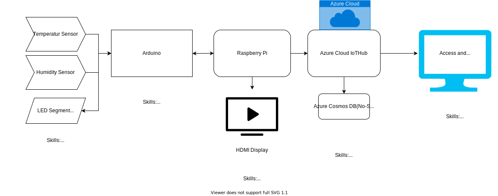

# rpi-arduino-sensor-demo
Demo project to display RPI, arduino and Azure combinations for IoT applications

* ### **Architecture of the project:**
https://drive.google.com/file/d/10gf7Q58NxgS6JjXQNH0WHzFQdLnI9Gn-/view?usp=sharing

TEST UPDATE
